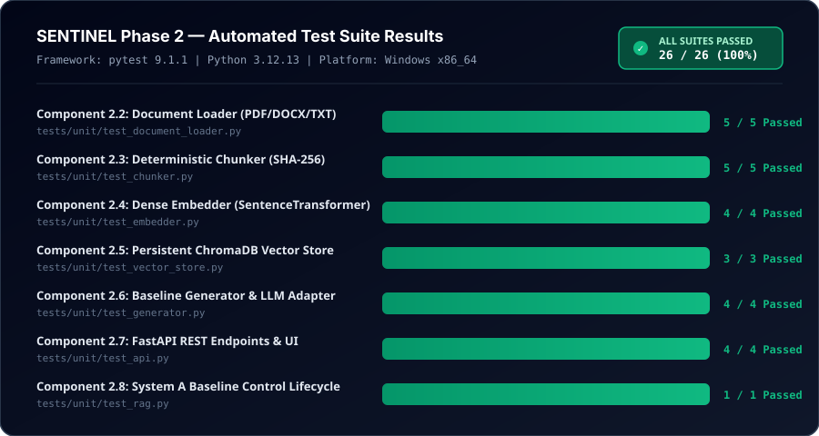
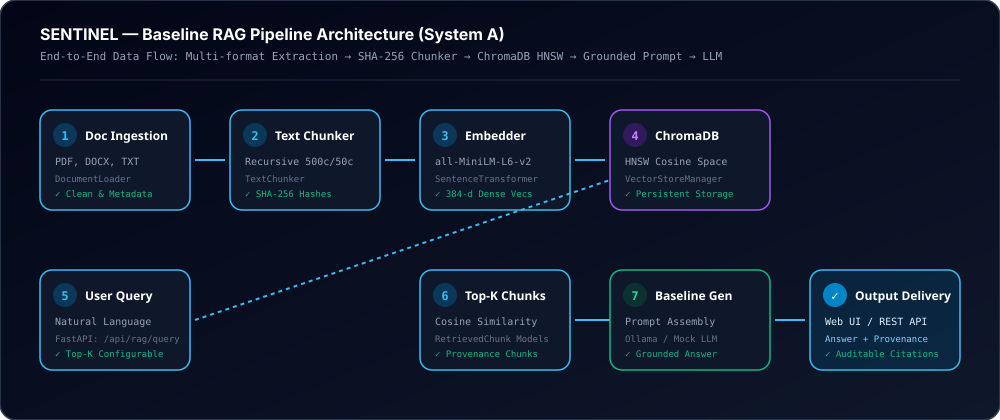
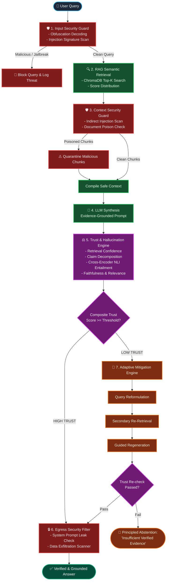
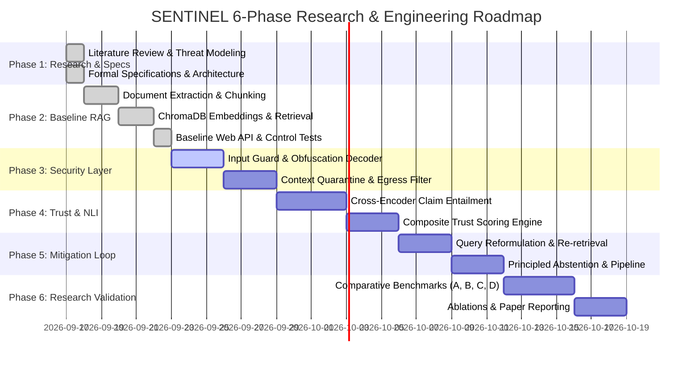

# SENTINEL: A Secure and Trustworthy RAG System

<p align="center">
  
</p>

<p align="center">
  <em>A Secure and Trustworthy Retrieval-Augmented Generation System with Multi-Layer Prompt Injection Defense, Document Poisoning Quarantine, and Evidence-Grounded Hallucination Mitigation.</em>
</p>

<p align="center">
  
  
  
  
  
  
  
  
</p>

---

## 📌 Core Principle

> ### **"Secure the Context. Verify the Answer. Trust the Output."**

SENTINEL is an academic research-oriented system designed to investigate and resolve the fundamental vulnerabilities of Retrieval-Augmented Generation (RAG):
1. **Adversarial Exploitation**: Direct prompt injection, indirect prompt injection concealed inside retrieved passages, and corpus/knowledge-base poisoning.
2. **Epistemic Unreliability**: Intrinsic and extrinsic hallucinations where the LLM asserts ungrounded claims absent from the retrieved evidence.
3. **Absence of Trust Measurement**: Failure to quantify evidential support, leading models to emit confabulated answers instead of principled abstention.

---

## 🖥️ Live Web Application Interface

Below is an authentic visual preview of the operational SENTINEL web portal in action, illustrating real-time document ingestion, query execution, and verifiable evidence inspection:

<p align="center">
  
</p>

---

## 📊 Automated Test Suite Results (100% Passing)

Every component is independently tested and verified through automated test suites in pytest. All 26 unit and integration tests are passing with zero failures:

<p align="center">
  
</p>

### Detailed Component Verification Matrix

| Component | Test File | Verified Capabilities | Status |
| :--- | :--- | :--- | :--- |
| **2.2: Document Loader** | [`tests/unit/test_document_loader.py`](tests/unit/test_document_loader.py) | PDF, DOCX, TXT extraction, byte streams, carriage return cleaning, null-byte stripping, metadata preservation. | **5 / 5 Passed** |
| **2.3: Deterministic Chunker** | [`tests/unit/test_chunker.py`](tests/unit/test_chunker.py) | Recursive splitting (`\n\n`, `\n`, sentence delimiters), overlap preservation, deterministic SHA-256 chunk IDs, offset tracking. | **5 / 5 Passed** |
| **2.4: Dense Embedder** | [`tests/unit/test_embedder.py`](tests/unit/test_embedder.py) | Hugging Face `all-MiniLM-L6-v2` 384-d vectors, lazy singleton loading, batch encoding, semantic cosine distance ranking. | **4 / 4 Passed** |
| **2.5: Persistent Vector Store** | [`tests/unit/test_vector_store.py`](tests/unit/test_vector_store.py) | Embedded ChromaDB persistent store, cosine space, top-$K$ semantic querying, threshold filtering, document deletion, stats. | **3 / 3 Passed** |
| **2.6: Baseline Generator** | [`tests/unit/test_generator.py`](tests/unit/test_generator.py) | Tagged source prompt assembly, multi-provider LLM adapter (Ollama `codellama`, MockLLM for CI), latency instrumentation. | **4 / 4 Passed** |
| **2.7: FastAPI REST API** | [`tests/unit/test_api.py`](tests/unit/test_api.py) | `/api/health`, `/api/documents/upload`, `/api/rag/query`, `/api/documents`, `/favicon.ico`, error boundaries. | **4 / 4 Passed** |
| **2.8: System A Lifecycle** | [`tests/unit/test_rag.py`](tests/unit/test_rag.py) | End-to-end integration test verifying complete unaugmented Baseline RAG pipeline as an immutable control benchmark. | **1 / 1 Passed** |
| **TOTAL** | **7 Test Modules** | **Full Pipeline Verification** | **26 / 26 Passed (100%)** |

---

## 🏗️ System Architecture & Data Flow

<p align="center">
  
</p>

### Pipeline Execution Flow



---

## 🛡️ Multi-Layer Defense-in-Depth Model

SENTINEL establishes four defense barriers to protect every stage of query resolution:

```
                                  DEFENSE-IN-DEPTH MATRIX
                                  
  [Barrier 1: Ingestion Guard]  ──► Scans raw documents pre-indexing; quashes hidden prompts.
  [Barrier 2: Input Guard]      ──► Normalizes Base64/Unicode homoglyphs; blocks direct jailbreaks.
  [Barrier 3: Context Guard]    ──► Inspects top-K retrieved chunks; quarantines indirect injections.
  [Barrier 4: Egress Guard]     ──► Intercepts output leaks, credential dumps, and exfiltration links.
```

| Defense Barrier | Location | Inspection Method | Threats Defeated |
| :--- | :--- | :--- | :--- |
| **Barrier 1: Ingestion Scanner** | Pre-Indexing (Upload) | Structural parser, heuristic payload detector, hidden text identifier. | Document poisoning, embedded malicious instructions. |
| **Barrier 2: Input Guard** | Pre-Retrieval (Query) | Canonicalization, zero-width stripper, regex banks, jailbreak heuristics. | Direct prompt injections, roleplay overrides, delimiter hijacking. |
| **Barrier 3: Context Quarantine**| Post-Retrieval (Chunks) | Second-pass semantic security filter over top-$K$ retrieved vectors. | Indirect prompt injection payloads inside retrieved context. |
| **Barrier 4: Egress Filter** | Post-Generation (Output) | Regex token matching for leaked system prompts, credentials, markdown image tags. | Data exfiltration, system prompt extraction, credential leaks. |

---

## ⚖️ Trust & Hallucination Verification Engine

Rather than treating LLM generations as unquestioned ground truth, the Trust Engine evaluates answer factuality via three evidence signals:

```
                            COMPOSITE TRUST SCORING ARCHITECTURE
                            
    ┌──────────────────────┐      ┌──────────────────────┐      ┌──────────────────────┐
    │ Retrieval Confidence │      │   NLI Faithfulness   │      │   Answer Relevance   │
    │  Score Margin & Sim  │      │  Claim Entailment %  │      │ Query-Answer Sim     │
    └──────────┬───────────┘      └──────────┬───────────┘      └──────────┬───────────┘
               │                             │                             │
               └──────────────────────┬──────┴─────────────────────────────┘
                                      ▼
                        ┌───────────────────────────┐
                        │   Composite Trust Score   │
                        │   Status: HIGH/MED/LOW    │
                        └───────────────────────────┘
```

### Mathematical Formulations

1. **Retrieval Confidence ($C_{\text{retrieval}}$)**:
   $$C_{\text{retrieval}} = \frac{1}{K} \sum_{i=1}^K s_i \cdot \exp(-\lambda (i-1))$$
   Where $s_i$ denotes the cosine similarity of chunk $i$, down-weighting lower ranked chunks with decay rate $\lambda$.

2. **Atomic Propositional Decomposition**:
   The draft answer $y$ is decomposed into a set of discrete propositional claims:
   $$C = \{c_1, c_2, \dots, c_m\}$$

3. **Directional NLI Claim Entailment**:
   Each claim $c_i$ is evaluated against retrieved context $K$ using a cross-encoder NLI model (`cross-encoder/nli-deberta-v3-small`):
   $$\text{NLI}(c_i, K) \in \{\text{Entailment}, \text{Neutral}, \text{Contradiction}\}$$

4. **Faithfulness Ratio ($S_{\text{faith}}$)**:
   $$S_{\text{faith}} = \frac{|\{c_i \in C \mid \text{NLI}(c_i, K) = \text{Entailment}\}|}{|C|}$$

5. **Composite Trust Score ($\text{TS}$)**:
   $$\text{TS} = w_1 \cdot C_{\text{retrieval}} + w_2 \cdot S_{\text{faith}} + w_3 \cdot S_{\text{rel}}$$
   - $\text{TS} \ge 0.75 \implies \textbf{HIGH TRUST}$ (Deliver response)
   - $0.50 \le \text{TS} < 0.75 \implies \textbf{MEDIUM TRUST}$ (Deliver with caveat annotations)
   - $\text{TS} < 0.50 \implies \textbf{LOW TRUST}$ (Trigger Adaptive Mitigation)

---

## 🔬 Four-Way Comparative Experimental Study

In Phase 6, SENTINEL will be evaluated through controlled scientific benchmarking across **four distinct system configurations**:

```
┌────────────────────────────────────────────────────────────────────────────────────────┐
│                               THE FOUR COMPARATIVE SYSTEMS                             │
├──────────────────┬─────────────────────────────────────────────┬───────────────────────┤
│ System           │ Architectural Pipeline Configuration        │ Research Purpose      │
├──────────────────┼─────────────────────────────────────────────┼───────────────────────┤
│ **A. Baseline**  │ Query ──► Retrieval ──► LLM ──► Answer      │ Control Group         │
├──────────────────┼─────────────────────────────────────────────┼───────────────────────┤
│ **B. RAG + Sec** │ Query ──► Security ──► Retrieval ──► LLM    │ Isolate Security Gain │
├──────────────────┼─────────────────────────────────────────────┼───────────────────────┤
│ **C. RAG + Trust**│ Query ──► Retrieval ──► LLM ──► Trust Engine│ Isolate Trust Gain    │
├──────────────────┼─────────────────────────────────────────────┼───────────────────────┤
│ **D. SENTINEL**  │ Complete Multi-Layer Security + RAG +       │ Unified Research      │
│                  │ Trust + Closed-Loop Mitigation + Abstention │ System Under Test     │
└──────────────────┴─────────────────────────────────────────────┴───────────────────────┘
```

---

## 🗺️ Six-Phase Implementation Roadmap



---

## 👥 Four-Laptop Team Ownership & Git Workflow

```
                            GITHUB REPOSITORY
                                    │
                            sharadpawarsaini/
                      sentinel-secure-trustworthy-rag
                                    │
            ┌───────────────┬───────┴───────┬───────────────┐
            ▼               ▼               ▼               ▼
         Bhumika          Adhya          Anwesha          Sharad
       (feature/rag) (feature/security)(feature/trust)(feature/mitigation)
            │               │               │               │
            └───────────────┴───────┬───────┴───────────────┘
                                    ▼
                                 DEVELOP
                                    ▼
                                  MAIN
```

### Team Responsibility Matrix

| Member | Focus Domain | Git Branch | Module Path | Core Deliverables |
| :--- | :--- | :--- | :--- | :--- |
| **Bhumika** | **RAG Foundation** | `feature/rag` | `sentinel/rag/` | PDF/DOCX/TXT extraction, chunking, embeddings, ChromaDB interface, semantic retrieval, baseline prompt assembly. |
| **Adhya** | **Security Layer** | `feature/security` | `sentinel/security/` | Direct injection detector, Base64/Unicode de-obfuscator, document poison scanner, context indirect injection guard, egress filter. |
| **Anwesha** | **Trust & NLI** | `feature/trust` | `sentinel/trust/` | Retrieval confidence calculation, atomic claim extractor, cross-encoder NLI directional entailment, faithfulness ratio, composite trust scoring. |
| **Sharad** | **Architecture & Integration** | `feature/mitigation`<br>`feature/integration` | `sentinel/backend/`<br>`sentinel/mitigation/`<br>`sentinel/pipeline/` | FastAPI orchestration, query reformulation, secondary re-retrieval, regeneration, principled abstention, UI coordination, and benchmark harness. |

---

## 🚀 Quickstart: Running the Web Application

### 1. Clone & Set Up Environment
```bash
git clone https://github.com/sharadpawarsaini/sentinel-secure-trustworthy-rag.git
cd sentinel-secure-trustworthy-rag

# Activate virtual environment
.\.venv\Scripts\activate.ps1

# (Optional) Install dependencies if setting up on a new laptop
uv pip install -r requirements.txt
```

### 2. Start the Live Server
```powershell
.\.venv\Scripts\uvicorn.exe sentinel.backend.api:app --reload --host 127.0.0.1 --port 8000
```

### 3. Open in Browser
- **Web Portal:** [http://127.0.0.1:8000](http://127.0.0.1:8000)
- **Interactive Swagger Docs:** [http://127.0.0.1:8000/docs](http://127.0.0.1:8000/docs)

### 4. Run the Full Test Suite
```powershell
.\.venv\Scripts\pytest.exe tests/unit/ -v
```

---

## 🎓 Academic Defense / Viva Quick Reference

> **Question: "What is SENTINEL?"**
> 
> *"SENTINEL is a research-oriented Secure and Trustworthy RAG system designed to investigate prompt injection, document poisoning, and hallucination risks in retrieval-augmented generation. It combines security detection, evidence-based trust assessment, adaptive mitigation, and principled abstention into a unified pipeline. We first build a conventional RAG baseline and then incrementally add security, trust, and mitigation layers. Finally, we compare the different configurations through controlled experiments and ablation studies to measure their effectiveness, reliability, and performance."*

> **Question: "What is your actual contribution?"**
> 
> *"Our contribution is not simply building another chatbot or RAG application. We are designing and experimentally evaluating an integrated security-and-trust pipeline for RAG—including attack detection, context security, trust assessment, adaptive mitigation, and abstention—and studying the effect of each layer through baseline comparisons and ablation experiments."*

---

<p align="center">
  <b>SENTINEL Research Project</b> • Maintained by Sharad, Bhumika, Adhya & Anwesha
</p>
